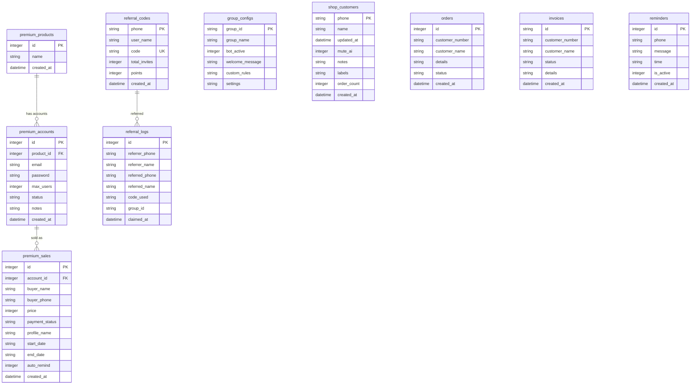

# 📄 DOKUMEN PERSYARATAN PRODUK (PRD)
## SISTEM ASISTEN VIRTUAL MULTI-PLATFORM & OTOMASI BISNIS (JAJAN DIGITAL)
**Versi Dokumen:** 2.0.0  
**Status Sistem:** Production Ready  
**Arsitektur Inti:** Node.js (v18+), SQLite3 Relasional, WebSockets (Socket.io), Puppeteer/WWebJS, Telegram Bot API, Multi-Provider AI RAG & Local OCR.

---

## 1. RINGKASAN EKSEKUTIF & TUJUAN SISTEM

Sistem **Asisten Virtual Jajan Digital** adalah platform otomasi operasional bisnis, layanan pelanggan (CS AI), manajemen grup, inventaris langganan premium, dan pembukuan transaksi otomatis yang beroperasi 24/7 di atas platform **WhatsApp** dan **Telegram**.

Sistem dirancang dengan arsitektur *event-driven* modular yang memisahkan logika orkestrasi pesan, penegakan keamanan grup (*guarding*), manajemen inventaris produk digital, sistem afiliasi referral, serta mesin kecerdasan buatan (*AI fallback*) dengan kemampuan rotasi API key dinamis dan *context caching*.

---

## 2. SPESIFIKASI ARSITEKTUR & STACK TEKNIS

| Komponen | Teknologi / Pustaka | Peran Teknis |
| :--- | :--- | :--- |
| **Runtime Environment** | Node.js (v18 LTS / v20 LTS) | Eksekusi server backend asynchronous & event loop. |
| **Database Mesin** | SQLite3 (`database.sqlite`) via `sqlite` & `sqlite3` driver | Database relasional lokal dengan integritas *foreign key*, transaksi ACID, dan migrasi otomatis. |
| **WhatsApp Engine** | `whatsapp-web.js` (v1.25.0) via Chromium Puppeteer | Antarmuka reverse-engineered WhatsApp Web client dengan manajemen sesi persisten. |
| **Telegram Engine** | `node-telegram-bot-api` (v1.2.0) | Integrasi Bot Telegram berbasis Webhook/Polling dengan simulasi action typing & photo upload. |
| **AI LLM Gateway** | Google Gemini (2.0 Flash / Pro), Groq (Llama 3 / Mixtral), OpenRouter, DeepSeek, Local Qwen | Mesin pemrosesan bahasa alami (NLP) untuk CS Fallback, RAG dokumen toko, dan Boss AI Assistant. |
| **Vision & OCR Engine** | `tesseract.js` (v7.0.0) & `pdf-parse` (v2.4.5) | Ekstraksi teks struk pembayaran (bank/e-wallet) dan pembacaan dokumen knowledge base PDF secara lokal. |
| **Real-time Pipeline** | `socket.io` (v4.8.3) & `express` (v5.2.1) | Komunikasi dua arah untuk streaming log percakapan, notifikasi transaksi, dan telemetri API health. |

---

## 3. MATRIKS FITUR, KEUNGGULAN & BATAS SISTEM (FEATURE BREAKDOWN)

---

### FITUR 1: Mesin AI Customer Service & Basis Pengetahuan RAG
*Modul: `src/services/ai/aiService.js`*

Menyediakan kemampuan asisten virtual cerdas yang memahami konteks produk toko, aturan operasional, dan kepribadian brand untuk melayani pelanggan secara otomatis saat navigasi menu statis tidak terpenuhi.

*   **Keunggulan Utama:**
    1.  **Multi-Provider AI Gateway & Auto-Fallback**: Mendukung integrasi simultan ke Google Gemini, Groq, OpenRouter, dan DeepSeek. Jika satu provider mengalami *rate limit* (HTTP 429) atau *outage* (HTTP 500/503), sistem secara otomatis mengalihkan request ke provider cadangan tanpa memutuskan interaksi pengguna.
    2.  **Gemini Context Caching Terpadu**: Otomatis membuat dan menggunakan *Context Cache* (`cachedContents`) untuk dokumen knowledge base berukuran besar (>130.000 karakter), memangkas latensi respon hingga 70% dan menghemat kuota token token prompt.
    3.  **Algoritma Gemini API Key Rotation Dinamis**: Mampu mengelola *pool* puluhan API Key Gemini. Jika sebuah kunci menyentuh limit kuota, sistem memutar index kunci aktif secara otomatis dan menandai masa pendinginan (*cooldown*).
    4.  **Retrieval-Augmented Generation (RAG) Lokal**: Membaca dan menggabungkan seluruh dokumen teks (`.txt`) dan PDF (`.pdf`) di direktori `knowledge/` ke dalam memori kerja AI secara real-time tanpa perlu restart server.
    5.  **Anti-Hallucination Guardrails**: Sistem prompt terstandarisasi yang melarang AI mengarang harga, nomor rekening tujuan selain yang tercatat, atau memberikan janji layanan di luar SOP toko.

*   **Batas & Limitasi Fitur:**
    1.  **Ketergantungan Kuota Provider Eksternal**: Jika seluruh API Key dalam pool habis kuota gratisannya (HTTP 429 menyeluruh) dan tidak ada provider cadangan yang aktif, bot tidak dapat memberikan balasan AI (fallback ke pesan manual/menunggu admin).
    2.  **Batas Ukuran Dokumen Knowledge**: Pembacaan dokumen PDF di memori RAM server dibatasi maksimal ~20MB per berkas agar tidak membebani penggunaan RAM Node.js pada VPS berspesifikasi rendah (1 Core / 1GB RAM).
    3.  **Latensi Jaringan AI**: Respon AI sangat bergantung pada koneksi internet server ke endpoint provider (rata-rata latensi normal: 800ms - 2.500ms).

---

### FITUR 2: Orkestrasi Dual-Platform (WhatsApp & Telegram Engine)
*Modul: `src/services/whatsapp/client.js`, `src/services/telegram/client.js`, `src/services/whatsapp/messageHandler.js`*

Menjalankan dua saluran komunikasi bisnis utama secara paralel dengan basis logika bisnis dan database transaksi yang tunggal (*single source of truth*).

*   **Keunggulan Utama:**
    1.  **Pemisahan Logika Modular (8 Handlers)**: Arsitektur pemrosesan pesan dipecah menjadi 8 modul spesifik (*guard, order, admin command, admin menu, media, boss AI, customer, referral*), mencegah kegagalan satu fungsi mengganggu fungsi lainnya (*fault isolation*).
    2.  **Anti-Ban Typing Simulation**: Mengirimkan sinyal *chat state typing* (1.000ms - 2.000ms) dan penundaan respons acak sebelum pesan terkirim untuk mensimulasikan perilaku pengetikan manusia nyata, mengurangi risiko pemblokiran nomor oleh sistem spam WhatsApp.
    3.  **Dukungan WhatsApp LID (Linked ID) Baru**: Algoritma normalisasi kontak yang mengenali format ID WhatsApp modern (`@lid`) maupun format standar (`@c.us`), menjaga pengenalan identitas Bos/Admin tetap akurat.
    4.  **Auto-Reconnect & Headless Chrome Recovery**: Secara mandiri mendeteksi *browser crash* atau pemutusan koneksi WebSocket WhatsApp dan melakukan inisialisasi ulang instance Chromium di latar belakang.
    5.  **Telegram Native Slash Commands**: Secara otomatis mendaftarkan daftar perintah (`/menu`, `/promo`, `/qris`, `/status`, `/reset`, `/boton`, `/botoff`, dll.) ke BotFather via API `setMyCommands`.

*   **Batas & Limitasi Fitur:**
    1.  **WhatsApp Web Session Invalidation**: Jika pengguna secara manual menekan "Keluar dari Semua Perangkat" di aplikasi WhatsApp ponsel utama, sistem wajib melakukan pemindaian ulang QR Code.
    2.  **Konsumsi Memori Puppeteer**: Instance Chromium headless membutuhkan alokasi RAM minimal 400MB - 700MB. VPS dengan RAM < 1GB wajib menggunakan swap file.
    3.  **Aturan Anti-Spam Telegram**: Telegram membatasi pengiriman pesan broadcast ke grup maksimal 30 pesan per detik (*rate limit global Telegram API*).

---

### FITUR 3: Mesin Pohon Menu Interaktif & Pemicu Kata Kunci
*Modul: `src/handlers/customerHandler.js`, `src/handlers/helpers.js`*

Menyediakan sistem katalog produk dan panduan layanan berbasis navigasi hierarkis angka multi-level yang dapat dikonfigurasi secara independen per-grup maupun pesan pribadi.

*   **Keunggulan Utama:**
    1.  **Struktur Pohon Dinamis Multi-Level**: Mendukung kategori bercabang tanpa batas kedalaman (*unlimited nested categories & items*).
    2.  **Navigasi Ramah Pengguna**: Mendukung tombol navigasi universal: angka `0` untuk kembali ke 1 tingkat sebelumnya, dan tanda pagar `#` untuk melompat kembali ke Menu Utama.
    3.  **Pemicu Kata Kunci Kustom (Keyword Trigger Matcher)**: Mengizinkan pemetaan kata kunci tertentu (misal: "netflix", "canva", "pricelist") untuk langsung memunculkan konten produk tanpa harus menelusuri menu dari awal.
    4.  **Footer Navigasi Otomatis**: Menambahkan petunjuk aksi secara otomatis di akhir pesan menu sesuai dengan level hierarki yang sedang diakses pelanggan.

*   **Batas & Limitasi Fitur:**
    1.  **Pilihan Navigasi Berbasis Teks**: Menggunakan input teks berbasis angka (1, 2, 3...) karena keterbatasan WhatsApp Web API resmi yang telah mendepresiasi *interactive list buttons* pada akun non-Business Cloud API.
    2.  **Timeout Sesi Navigasi**: Jika pelanggan tidak merespons dalam jendela waktu tertentu, status posisi menu kembali ke *root* pada pesan berikutnya.

---

### FITUR 4: Manajemen Grup Otomatis & Keamanan (Guard Handler)
*Modul: `src/handlers/guardHandler.js`, `src/handlers/adminCommandHandler.js`, `src/routes/groups.js`*

Memberikan kendali penuh bagi Admin/Host untuk mengelola operasional grup WhatsApp, keamanan dari spammer, dan penegakan aturan grup secara otomatis.

*   **Keunggulan Utama:**
    1.  **Otomasi Buka/Tutup Grup Berjadwal & Instan**: Perintah cepat `.buka` dan `.tutup` (serta scheduler otomatis harian) yang mengubah izin pengiriman pesan grup (*announcement mode*) secara dinamis menggunakan injeksi modul internal WhatsApp Web.
    2.  **Anti-Link Spammer & Auto-Kick**: Mendeteksi tautan undangan grup WhatsApp lain atau link mencurigakan dari non-admin, secara otomatis menghapus pesan dan dapat mengeluarkan (*kick*) pengirim jika dikonfigurasi.
    3.  **Pencatatan Otomatis CRM Pelanggan**: Setiap kontak baru yang mengirim pesan ke bot atau bertransaksi di grup otomatis dicatat ke tabel `shop_customers` (nama, nomor HP, total order, tag).
    4.  **Auto V-Card Contact Sender**: Mengirimkan kartu kontak resmi toko/admin kepada pengguna baru yang membutuhkan kontak personal owner.
    5.  **Perintah Moderasi Lengkap**: Mendukung command instan via chat: `.kick` (keluarkan member via reply), `.promote` (angkat admin), `.demote` (copot admin), `.id` (ambil ID grup), dan `.resetpass` (reset sandi admin via WA).

*   **Batas & Limitasi Fitur:**
    1.  **Syarat Hak Akses Admin WhatsApp**: Bot **WAJIB** memiliki status sebagai Admin Grup di WhatsApp agar dapat mengeksekusi aksi buka/tutup grup, hapus pesan member, promote/demote, dan kick member.
    2.  **Sensitivitas Update Modul Webpack WhatsApp**: Fitur *setGroupProperty* menggunakan pemindaian modul dinamis (`WAWebSetPropertyGroupAction`). Jika WhatsApp merilis arsitektur obfuskasi baru, modul membutuhkan adaptasi pencarian fallback.

---

### FITUR 5: Manajemen Transaksi, Kas & Pembuatan Invoice Otomatis
*Modul: `src/handlers/orderHandler.js`, `src/handlers/adminCommandHandler.js`, `src/routes/orders.js`*

Mengotomatiskan alur pencatatan pesanan dari chat WhatsApp menjadi catatan transaksi database resmi dan menghasilkan nomor invoice dengan zona waktu terstandarisasi.

*   **Keunggulan Utama:**
    1.  **Deteksi Format Pembelian Alami**: Otomatis mendeteksi pesan pelanggan berformat `pesan: [nama barang]` atau `beli: [nama barang]` dan merekam order baru berstatus `PENDING`.
    2.  **Generator Invoice Real-time via Reply Chat**: Admin cukup me-reply pesan order pelanggan di grup dengan command `.proses` atau `.done` / `done`. Sistem otomatis membuat invoice resmi:
        *   Format Nomor: `INV-YYYYMMDD-HHMMSS` (Zona Waktu Asia/Jakarta / WIB).
        *   Format Pesan: Struk rapi berisikan nama toko, nomor referensi, nama/tag pelanggan, status transaksi, dan catatan tambahan.
    3.  **Sinkronisasi Status Pesanan & Pelanggan**: Mengubah status order dari `PENDING` ➔ `PROCESS` ➔ `DONE` secara otomatis di database SQLite dan menambahkan hitungan *order count* pelanggan terkait.
    4.  **Pencatatan Kas & Mutasi Finansial**: Mendukung pencatatan riwayat keuangan (pemasukan/pengeluaran) yang tersimpan di `key_value_store` dan dapat diekspor untuk pelaporan harian.

*   **Batas & Limitasi Fitur:**
    1.  **Ketergantungan Reply/Mention**: Command `.done` / `.proses` mengandalkan fitur reply/quote pesan WhatsApp untuk mengidentifikasi nomor pelanggan target secara akurat. Jika tidak me-reply pesan, admin wajib menyertakan nomor HP target di dalam pesan.
    2.  **Status Pembayaran Manual**: Sistem tidak terintegrasi langsung dengan payment gateway bank (BCA/Mandiri/BRI) via webhook API; verifikasi pelunasan dilakukan oleh Admin atau via modul OCR Struk.

---

### FITUR 6: Manajemen Inventaris Akun Premium & Pengingat Masa Aktif
*Modul: `src/routes/premium.js`, `src/scheduler/reminderJob.js`*

Sistem pengelolaan stok akun langganan digital (Netflix, Spotify, Canva, YouTube Premium, dll.) baik tipe *Sharing* maupun *Private* beserta otomatisasi pengingat masa aktif.

*   **Keunggulan Utama:**
    1.  **Dukungan Akun Multi-Slot (Sharing Account)**: Satu akun induk dapat dialokasikan untuk beberapa profil/pembeli sesuai batasan `max_users`. Status stok berubah otomatis menjadi *Penuh* jika kuota slot habis, atau *Tersedia* jika slot masih ada.
    2.  **Pelacakan Tanggal Mulai & Jatuh Tempo**: Mencatat tanggal pembelian (`start_date`) dan tanggal berakhir (`end_date`) per profil pembeli.
    3.  **Otomasi Pengingat Jatuh Tempo (H-5 hingga Hari-H)**: Modul scheduler harian memindai database dan mengidentifikasi akun-akun yang akan kedaluwarsa dalam 5 hari ke depan untuk ditindaklanjuti dengan pengiriman pesan penawaran perpanjangan (*renewal*).
    4.  **Kalkulasi Metrik Omset Bulanan**: Menghitung estimasi omset aktif dan rasio ketersediaan stok secara otomatis.

*   **Batas & Limitasi Fitur:**
    1.  **Pengisian Kredensial Manual**: Kredensial akun email dan password diinput oleh Admin ke database (tidak ada integrasi API pembuatan akun otomatis ke penyedia pihak ketiga seperti Netflix/Spotify).
    2.  **Format Tanggal ISO/WIB**: Penginputan tanggal harus mengikuti format standar (`YYYY-MM-DD`) agar perhitungan selisih hari tidak menghasilkan nilai *NaN*.

---

### FITUR 7: Mesin Referral & Afiliasi Multi-Grup dengan Leaderboard Live
*Modul: `src/handlers/referralHandler.js`, `src/routes/referral.js`*

Sistem viral marketing berbasis kode referral unik untuk meningkatkan jumlah anggota grup WhatsApp dan melacak performa promosi masing-masing member.

*   **Keunggulan Utama:**
    1.  **Pembuatan Kode Unik Otomatis**: Member cukup mengetik `!myref` / `!kode` di grup. Bot otomatis menghasilkan kode unik (kombinasi nama dan 4 digit nomor HP) dan membalas dengan kartu referral siap sebar lengkap dengan link tautan grup.
    2.  **Klaim Reward Instan**: Member baru yang bergabung dapat mengklaim bonus dengan mengetik `!klaim <KODE_REFERRAL>`. Sistem memvalidasi keabsahan kode, menambahkan poin pengundang, dan mencatat log klaim ke tabel `referral_logs`.
    3.  **Anti-Self Referral & Anti-Double Claim**: Mencegah pengguna mengklaim kodenya sendiri dan mengunci nomor HP agar hanya bisa mengklaim 1 kali seumur hidup.
    4.  **Halaman Publik Live Leaderboard (`/referral` & `/leaderboard`)**: Endpoint web publik ringan tanpa autentikasi yang menampilkan daftar Top 10 Pengundang Terbanyak, total partisipan, dan total poin beredar secara real-time.

*   **Batas & Limitasi Fitur:**
    1.  **Verifikasi Keanggotaan Fisik**: Poin diberikan saat member baru memasukkan command klaim secara sukarela; sistem tidak otomatis mendeteksi siapa yang menyebarkan link jika member baru tidak memasukkan kode klaim.
    2.  **Pencairan Poin Manual**: Penukaran poin menjadi reward/uang tunai dicatat dan diproses secara manual oleh Admin toko.

---

### FITUR 8: Mesin OCR Pengenalan Struk Pembayaran & Dokumen
*Modul: `src/services/ocr/ocrService.js`, `src/handlers/mediaHandler.js`*

Mengekstraksi teks dari gambar struk transfer bank (BCA, Mandiri, BRI, BNI, Seabank, Jago) dan e-wallet (GoPay, OVO, DANA, ShopeePay) yang dikirim pelanggan atau Bos.

*   **Keunggulan Utama:**
    1.  **Eksekusi OCR 100% Lokal**: Menggunakan engine `tesseract.js` terlatih (`ind.traineddata` & `eng.traineddata`) yang berjalan langsung di server tanpa mengirim gambar ke API pihak ketiga berbayar (aman privasi & hemat biaya).
    2.  **Ekstraksi Multi-Entitas**: Menganalisis gambar kuitansi untuk mengekstrak nominal uang (Rp), tanggal transfer, nomor referensi/rekening, dan nama pengirim.
    3.  **Portal Publik Upload Bukti (`/upload-bukti` & `/u`)**: Halaman web publik bagi pelanggan untuk mengunggah bukti bayar langsung dari browser jika terjadi kendala pengiriman gambar di WhatsApp.

*   **Batas & Limitasi Fitur:**
    1.  **Kualitas Gambar & Font**: Akurasi pembacaan karakter bergantung pada resolusi gambar, pencahayaan, dan tingkat kompresi WhatsApp (gambar buram/resolusi < 300px dapat menghasilkan salah baca angka nominal).
    2.  **Beban CPU Saat OCR**: Proses ekstraksi OCR memakan utilisasi CPU server selama 1-3 detik per gambar.

---

### FITUR 9: Asisten Pribadi Eksekutif untuk Owner (Boss AI Engine)
*Modul: `src/handlers/bossAiHandler.js`*

Modul khusus dengan hak istimewa (*privileged mode*) yang hanya merespons nomor telepon Bos/Owner untuk keperluan asistensi personal dan konfigurasi instan via chat.

*   **Keunggulan Utama:**
    1.  **Pembaruan Memori Otomatis (`#akubosmu`)**: Bos dapat menambahkan aturan bisnis baru secara langsung dari chat WhatsApp (contoh: `#akubosmu sandi wifi toko adalah ABC123`), dan sistem langsung menyimpannya ke memori permanen `knowledge/00_memori_otomatis.txt`.
    2.  **Penjadwalan Pengingat Fleksibel (`#ingatkan`)**: Mendukung bahasa alami untuk menyetel pengingat waktu (contoh: `#ingatkan jam 14:00 | Telepon Vendor`).
    3.  **Pengaturan Jadwal Laporan Harian (`#jadwallaporan`)**: Mengubah jam pengiriman rekapitulasi harian via chat (contoh: `#jadwallaporan 18:00`).
    4.  **Obrolan Konsultatif Cerdas**: Menjawab pertanyaan manajerial, draf pesan promosi, dan analisis bisnis dengan model AI terbaik.

*   **Batas & Limitasi Fitur:**
    1.  **Validasi Nomor Ketat**: Hanya merespons nomor yang cocok dengan parameter `boss_number` atau `boss_lid` di `config.json`.
    2.  **Format Perintah Khusus**: Perintah modifikasi sistem wajib diawali tagar tertentu (`#akubosmu`, `#ingatkan`, `#jadwallaporan`) agar tidak tertukar dengan obrolan biasa.

---

### FITUR 10: Pemantau Kesehatan & Diagnostik Pool API Key (AKM)
*Modul: `src/services/ai/aiService.js`, `src/routes/misc.js`*

Memantau status ketersediaan, kuota, dan latensi dari seluruh API Key yang terdaftar dalam sistem.

*   **Keunggulan Utama:**
    1.  **Pengujian Diagnostik Paralel (Throttled Burst)**: Menguji kesehatan puluhan API Key dengan jeda aman (*staggered delay*) untuk mencegah pemicuan *rate limit* Google.
    2.  **Klasifikasi Status Cerdas**: Membedakan antara kunci aktif (*OK*), kunci valid yang hanya terkena limit kuota sementara (*Quota Exceeded / HTTP 429*), dan kunci mati/kedaluwarsa (*Invalid Key / HTTP 400*).
    3.  **Pemantau Latensi Provider**: Mencatat waktu respon (dalam milidetik) untuk setiap provider untuk memilih rute tercepat.

*   **Batas & Limitasi Fitur:**
    1.  **Kebijakan Rate Limit Provider**: Pengujian massal (>50 kunci sekaligus) wajib diberi jeda minimal 150ms per panggilan agar tidak diblokir sementara oleh firewall Google Cloud.

---

### FITUR 11: Pekerjaan Latar Belakang & Penjadwalan Terpusat (Cron Schedulers)
*Modul: `src/scheduler/reminderJob.js`*

Menjalankan tugas-tugas periodik otomatis tanpa memerlukan intervensi manual dari operator.

*   **Keunggulan Utama:**
    1.  **Laporan Harian Status Server & Bot**: Setiap pagi (sesuai `report_time`), sistem mengirimkan rekap status koneksi, jumlah chat tertangani, dan kesehatan bot ke WhatsApp Bos.
    2.  **Pemberi Pengingat Tepat Waktu**: Mengeksekusi pesan pengingat yang disetel melalui perintah `#ingatkan` tepat pada jam yang ditentukan.
    3.  **Pemisahan Interval Eksekusi**: Menggunakan interval polling ringan (setiap 60 detik) dengan pengecekan berbasis flag harian untuk mencegah pengiriman pesan ganda (*duplicate execution prevention*).

*   **Batas & Limitasi Fitur:**
    1.  **Ketergantungan Jam Server (Timezone)**: Penjadwalan mengacu pada waktu lokal server atau zona waktu `Asia/Jakarta`. Jam server VPS wajib terkonfigurasi dengan NTP sinkron.

---

## 4. SKEMA BASIS DATA & STRUKTUR DATA RELASIONAL

Sistem mengelola 10 tabel inti pada database SQLite (`database.sqlite`):

---

## 5. PROTOKOL KEAMANAN, AUTENTIKASI & KEANDALAN DATA

1.  **Autentikasi Dasbor Berbasis Token Sesi**:
    *   Menggunakan *cookie session token* acak yang divalidasi oleh middleware `checkAuth`.
    *   Bypass aman khusus untuk endpoint publik: `/login`, `/u` (upload bukti), `/q` (QRIS), `/referral` (leaderboard), `/uploads/*`.
2.  **Mekanisme Backup & Restore 1-Klik**:
    *   Endpoint `/api/backup` mengompresi seluruh file database SQLite, konfigurasi JSON, dan dokumen knowledge base menjadi 1 file `.zip` via pustaka `archiver`.
    *   Endpoint `/api/restore` mengekstrak dan memulihkan data dari zip via `unzipper`.
3.  **Manajemen Kesalahan Global (Crash Protection)**:
    *   Pencegahan penghentian proses server menggunakan penanganan `process.on('uncaughtException')` dan `process.on('unhandledRejection')` dengan pencatatan log diagnostik terstruktur.
4.  **Sanitasi Input & Database Parameterization**:
    *   Seluruh query SQL dieksekusi menggunakan *Prepared Statements* berparameter (`?`) untuk menjamin kekebalan total terhadap serangan *SQL Injection*.

---

## 6. PANDUAN PENGUJIAN & VERIFIKASI FUNGSIONAL SISTEM

| Modul Uji | Skenario Pengujian | Hasil yang Diharapkan |
| :--- | :--- | :--- |
| **WhatsApp Client** | Jalankan `node index.js`, scan QR | Status beralih ke `CONNECTED`, log emit via Socket.io |
| **CS AI Fallback** | Kirim pesan di luar menu (misal: "apakah buka hari minggu?") | Bot merespons secara natural sesuai panduan `knowledge/` |
| **AI Key Failover** | Setel kunci pertama ke nilai invalid | Sistem otomatis memutar ke index kunci berikutnya dan berhasil menjawab |
| **Admin Command** | Reply pesan order pelanggan dengan `.done Lunas BCA` | Bot mengirimkan invoice resmi berformat Jakarta WIB dan menyimpan order |
| **Referral System** | Kirim `!myref` lalu kirim `!klaim <KODE>` dari nomor lain | Poin pengundang bertambah +10, log tercatat di tabel `referral_logs` |
| **Buka/Tutup Grup** | Ketik `.tutup` di grup WhatsApp | Izin pesan grup terkunci (hanya admin), bot membalas pengumuman |
| **OCR Struk** | Unggah struk transfer bank ke `/u` | Sistem membaca nominal dan tanggal transfer secara otomatis |

---

*Dokumen PRD ini disusun sebagai acuan standar teknis dan fungsional penuh bagi tim pengembang, arsitek perangkat lunak, dan pemilik produk Jajan Digital.*
